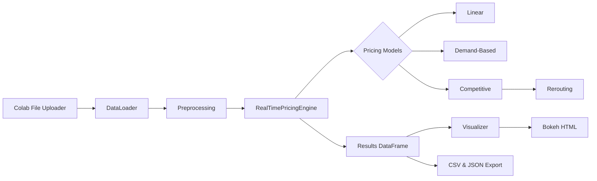

# IIT-Guwahati-Summer-Analytics-Hackathon
Project Overview: 
This project implements a real-time dynamic pricing engine for urban parking lots, simulating three complementary pricing strategies—Linear, Demand-Based, and Competitive models—and generating rerouting recommendations when lots exceed capacity. The pipeline includes data ingestion (CSV/Excel or generated sample), preprocessing and feature engineering, pricing calculation per timepoint, storage of price history, and interactive visualizations with Bokeh. The end-to-end simulation outputs pricing results, visual reports, and model configuration files for reproducibility.

## 🚀 Features

* **Real-Time Simulation**: Processes 30-minute interval data streams for multiple parking spaces.
* **Three Pricing Models**:

  * **Linear**: Incremental price adjustment based on occupancy rate.
  * **Demand-Based**: Composite demand scoring (occupancy, queue length, traffic, special days, vehicle type).
  * **Competitive**: Considers neighboring lot prices and occupancy, with rerouting suggestions when lots exceed 90% capacity.
* **Interactive Visualizations**: Bokeh-generated HTML plots displaying price trends and occupancy rates.
* **Google Colab Integration**: File upload via `google.colab.files` for seamless data ingestion.
* **Extensible Architecture**: Easily add new pricing strategies by subclassing the base `PricingModel`.

## 🛠️ Tech Stack

* **Environment**: Google Colab / Jupyter
* **Language**: Python 3.x
* **Data Handling**: Pandas, NumPy
* **Visualization**: Bokeh
* **File I/O**: `google.colab.files` for uploads, CSV, Excel, JSON
* **Scheduling & Timing**: `datetime`, `time`

## ⚙️ Architecture



## 🔍 Detailed Architecture & Workflow

1. **Data Loading & Generation**

   * **Google Colab Upload**: `DataLoader.upload_file()` uses `google.colab.files.upload()` to import a CSV/Excel file.
   * **Sample Data Fallback**: If not in Colab or upload fails, `generate_sample_data()` synthesizes realistic parking data (14 spaces × 73 days × 18 time slots).

2. **Data Preprocessing**

   * **Column Mapping**: Maps user-provided column names (e.g., `id` → `space_id`, `queuelength` → `queue_length`).
   * **Handling Missing Fields**: Adds defaults for any missing required columns (e.g., occupancy, capacity).
   * **Timestamp Assembly**: Combines separate `date` & `time` into a unified `timestamp`, or parses existing timestamps, or generates a standard time series.
   * **Feature Engineering**: Computes derived features—`occupancy_rate`, `hour`, `day_of_week`, normalized `queue_length_norm`, `traffic_level_norm`, and `vehicle_weight` based on type.

3. **Real-Time Pricing Simulation**

   * **Engine Initialization**: `RealTimePricingEngine` sets up three model instances (Linear, Demand-Based, Competitive).
   * **Stream Processing**: Groups data by timestamp and iterates with configurable `delay_seconds` to mimic live updates.
   * **Pricing Models**:

     * **Linear Model**: Adjusts price incrementally by α × occupancy\_rate.
     * **Demand-Based Model**: Calculates a demand score incorporating queue lengths, traffic levels, and special events, then scales via tanh.
     * **Competitive Model**: Extends Demand-Based logic, identifies nearby competitors via Euclidean distance, and adjusts pricing and rerouting suggestions when necessary.
   * **History Tracking**: Each model logs price history per space.

4. **Compilation & Export**

   * **Results Assembly**: `get_results_dataframe()` consolidates model outputs into a pandas DataFrame.
   * **Persistence**:

     * **CSV**: Exports `pricing_results.csv` containing all pricing decisions.
     * **JSON**: Saves `model_configuration.json` with hyperparameters and run metadata.

5. **Visualization & Analysis**

   * **Bokeh Plots**: `PricingVisualizer.create_price_comparison_plot()` generates interactive HTML showing price trajectories and occupancy overlays.
   * **Summary Statistics**: `create_summary_statistics()` outputs aggregate metrics and rerouting recommendation rates in the Colab logs.

## 📥 Installation & Usage in Colab

1. Open this notebook in Google Colab.
2. Ensure dependencies are installed:

   ```python
   !pip install pandas numpy bokeh
   ```
3. Run all cells.
4. When prompted, upload your CSV/Excel dataset via the Colab file picker.
5. View interactive plots saved as HTML and download output files.

## 📂 Files Generated

* `pricing_results.csv` & `model_configuration.json` (in Colab file system)
* `parking_prices_visualization.html` (downloadable interactive visualization)


