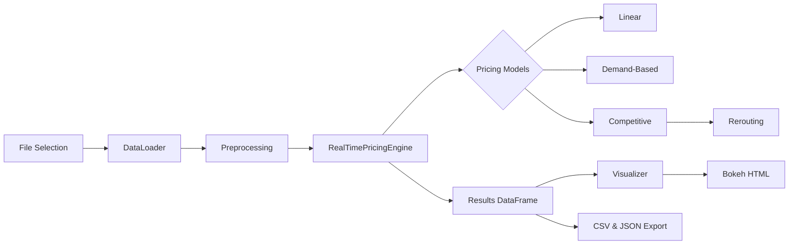

# IIT-Guwahati-Summer-Analytics-Hackathon
Project Overview: 
This project implements a real-time dynamic pricing engine for urban parking lots, simulating three complementary pricing strategies—Linear, Demand-Based, and Competitive models—and generating rerouting recommendations when lots exceed capacity. The pipeline includes data ingestion (CSV/Excel or generated sample), preprocessing and feature engineering, pricing calculation per timepoint, storage of price history, and interactive visualizations with Bokeh. The end-to-end simulation outputs pricing results, visual reports, and model configuration files for reproducibility.

## 🚀 Features

* **Real-Time Simulation**: Processes 30-minute interval data streams for multiple parking spaces.
* **Three Pricing Models**:

  * **Linear**: Incremental price adjustment based on occupancy rate.
  * **Demand-Based**: Composite demand scoring (occupancy, queue length, traffic, special days, vehicle type).
  * **Competitive**: Considers neighboring lot prices and occupancy, with rerouting suggestions when lots exceed 90% capacity.
* **Interactive Visualizations**: Bokeh-generated HTML plots displaying price trends and occupancy rates.
* **Extensible Architecture**: Easily add new pricing strategies by subclassing the base `PricingModel`.

## 🛠️ Tech Stack

* **Language**: Python 3.x
* **Data**: Pandas, NumPy
* **Visualization**: Bokeh
* **GUI**: Tkinter (for file upload dialog)
* **I/O**: CSV, Excel, JSON

## ⚙️ Architecture



## 🔍 Detailed Architecture & Workflow

1. **Data Loading & Generation**

   * **File Upload**: `DataLoader.upload_file()` uses Tkinter to prompt for a CSV/Excel file.
   * **Sample Data**: If no file is provided or loading fails, `generate_sample_data()` creates synthetic parking data (14 spaces × 73 days × 18 timepoints).

2. **Data Preprocessing**

   * **Column Mapping**: Auto-detects known column names (e.g., `id` → `space_id`, `queuelength` → `queue_length`).
   * **Missing Column Handling**: Fills defaults for any absent required fields.
   * **Timestamp Construction**: Combines `date` & `time` or parses existing `timestamp`; defaults to a regular time series if absent.
   * **Feature Engineering**: Calculates `occupancy_rate`, `hour`, `day_of_week`, normalized `queue_length_norm`, `traffic_level_norm`, and `vehicle_weight`.

3. **Real-Time Pricing Simulation**

   * **Engine Initialization**: `RealTimePricingEngine` registers three models (Linear, Demand-Based, Competitive).
   * **Batch Processing**: Groups records by timestamp and iterates in simulated real-time (configurable `delay_seconds`).
   * **Model Calculations**:

     * **Linear Model**: Adjusts price by α × occupancy\_rate.
     * **Demand-Based Model**: Computes demand score combining occupancy, queue, traffic, special days, and vehicle type; applies a tanh-based normalization.
     * **Competitive Model**: Inherits Demand-Based logic, finds nearby competitors via Euclidean distance, then modulates price based on competitor prices and occupancy; issues rerouting suggestions if >90% full.
   * **Price History Logging**: Each model updates its price history per space per timestamp.
   * **Rerouting Module**: Suggests alternative spaces when current lot occupancy >90% and nearby space utilization <70%.

4. **Results Compilation & Export**

   * **DataFrame Assembly**: `get_results_dataframe()` consolidates all pricing decisions into a pandas DataFrame.
   * **Persistence**:

     * **CSV**: Saves `pricing_results.csv` with full results.
     * **JSON**: Writes `model_configuration.json` capturing hyperparameters and timestamp.

5. **Visualization & Reporting**

   * **Interactive Plots**: `PricingVisualizer.create_price_comparison_plot()` builds Bokeh line charts for selected spaces, overlaying model prices and occupancy trends; saved as `parking_prices_visualization.html`.
   * **Performance Summary**: `create_summary_statistics()` prints aggregate and space-wise metrics (average, range, CV) and rerouting frequency.

## 📥 Installation & Usage

1. Clone the repository:

   ```bash
   git clone https://github.com/yourusername/parking-pricing.git
   cd parking-pricing
   ```
2. Install dependencies:

   ```bash
   pip install -r requirements.txt
   ```
3. Run the simulation:

   ```bash
   python dynamic_pricing.py
   ```
4. Select your data file (CSV/Excel) or let the script generate sample data.


